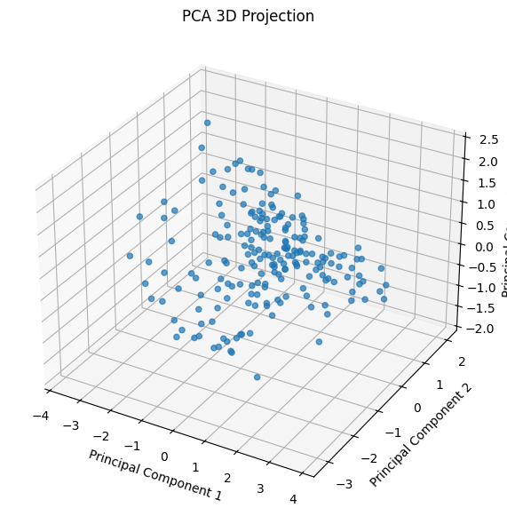
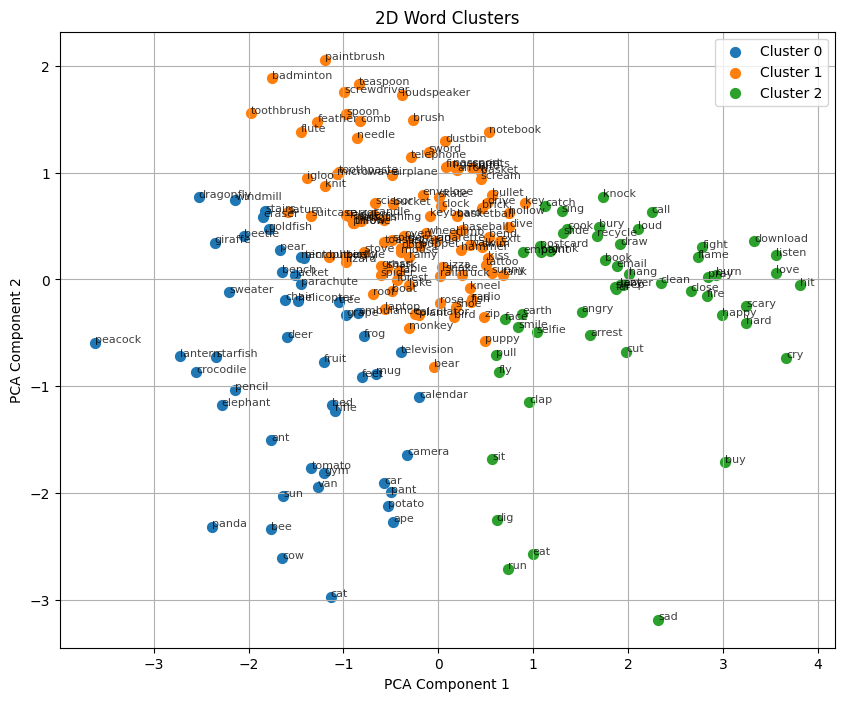

# Assignment 2 Report


## K-Means Clustering

Determining the Optimal Number of Clusters for 512
 dimensions:

 plot of Within-Cluster
 Sum of Squares (WCSS) against k 


So **Kmeans1 = 3**

After performing K-means clustering on dataset using Kmeans1,
the output is saved in `cluster_words_kmeans.csv`  file.


## Gaussian Mixture Models

Yes, both the classes are working as expected. 
-The GMM class implements the Expectation-Maximization (EM) algorithm, where it alternates between calculating the responsibilities (Expectation or E-step) and updating the parameters (Maximization or M-step). <br>
-This is computed using the current estimates of the Gaussian mixture model's parameters (weights, means, and covariances).  <br>
-Based on the responsibilities computed in the E-step, the model updates the parameters of the Gaussian components (weights, means, and covariances).  <br>
-The log-likelihood is calculated after every E-step and M-step cycle. This is a measure of how well the current model fits the data. The goal is to maximize this log-likelihood as much as possible.  <br>
-The class converges when the change in log-likelihood is smaller than a predefined tolerance (`tol`), ensuring that the model has reached a reasonable solution. <br>


### Using BIC (Bayesian Information Criterion) and AIC (Akaike Informa
tion Criterion)

The BIC and AIC plots against the number of number of Clusters(k) is : 

 

- The plot shows that there is a continuous increase in BIC and AIC from 1.   <br>
- The **best number of clusters (kgmm1)** based on this graph appears to be 1, where both BIC and AIC are relatively low.  <br>
- **Kgmm1 = 1**

The log_likelihood value obtained for Kgmm1 = 1 is 137260.67408603407


## Dimensionality Reduction and Visualization

-The new axes obtained from PCA are **principal components**.  <br>
-These are linear combinations of the original features, constructed in such a way that each principal component explains the maximum possible variance in the data while remaining orthogonal (uncorrelated) to the other components.  <br>
-Each component would similarly represent a subsequent direction of maximum variance in the dataset that is orthogonal to all previous components.  <br>
This process allows PCA to reduce the dimensionality of the data while preserving as much variance as possible, making it useful for visualization and analysis.  <br>


### Plotting the data in both 2D and 3D.


 

Based on a visual inspection, I would estimate approximately **3 clusters**


 
### THUS, **K2 = 3**


## PCA+Clustering
### K-means Clustering Based on 2D Visualization

After Performing K-means clustering on the dataset using the number of clusters
estimated from the 2D visualization of the dataset (k2),

I saved them in the `clustered_words_kmean_k2.csv` file.


### PCA + K-Means Clustering

**Scree Plot for finding Optimal number of Dimensions :**


To capture **90%** of the variance, the plot suggests selecting about **128 components**.

Now, ` elbow plot ` obtained by using the Reduced Data :


From the above plot we can observe the  elbow is at K = 5
So **Kkmeans3 = 5.**

**WCSS** for k=5: 3239.127942016528


###  GMM Clustering Based on 2D Visualization


Final Log-Likelihood with 3 clusters: -97322.01703391058


### PCA + GMMs


Based on the above figure the least BIC or AIC value is obtained for K = 3

**Kgmm3 = 3**

Final Convergence reached at iteration 5, with Log-Likelihood :

Iteration 1: Log-likelihood = -2082014.3014665316   
Iteration 2: Log-likelihood = -78017.75518162455  
Iteration 3: Log-likelihood = -78684.43380083243  
Iteration 4: Log-likelihood = -78690.5483581881  
Iteration 5: Log-likelihood = -78690.54835818811  
Convergence reached at iteration 5

After applying GMMs with kgmm3 to the dimensionally reduced dataset I save it as `clustered_words_gmm_kgmm3.csv`


## 7 Cluster Analysis

### 7.1 K- Means Cluster Analysis

- **KMeans for k=3** yields a Silhouette Score of ` 0.0441`  
- **KMeans for k=5** yields a Silhouette Score of `0.0323` 

KMeans = 3

### 7.2 GMM Cluster Analysis

- **GMM with k=2** has a Silhouette Score of `0.0354`
- **GMM with k=3** has a Silhouette Score of `0.0193`

KGmm = 2

### 7.3  7.3 Compare K-Means and GMMs
- **Kmeans with k=3** has a Silhouette Score of `0.0441`
- **GMM with k=2** has a Silhouette Score of `0.0354`


### 8 Hierarchical Clustering

The linkage methods and distance_metrics I considered are 

```jsx
linkage_methods = ['single', 'complete', 'average', 'ward']
distance_metrics = ['euclidean']

```

- Dendograms for each of the methods are shown below.

1. Single Linkage (top-left):

<p align="center">
  
</p>
    - Shows a "chaining" effect with many small, incremental merges  <br>
    - Difficult to identify distinct clusters   <br>
    - Tends to create elongated clusters   <br>


    
2. Ward Linkage (top-right):
<p align="center">
  
</p>
    - Clearer hierarchical structure with well-defined clusters    <br>
    - More balanced cluster sizes   <br>
    - Produces a more compact, tree-like structure   <br>


3. Average Linkage (bottom-left):
<p align="center">
  
</p>
    - More balanced structure compared to single linkage   <br>
    - Multiple distinct clusters visible   <br>
    - Intermediate between single and complete linkage in terms of cluster definition   <br>
   

    


4. Complete Linkage (bottom-right):
<p align="center">
  
</p>
    - Produces a balanced tree structure    <br>
    - Clear separation between clusters with distinct breaks   <br>
    - Tends to create more compact clusters compared to single linkage   <br>


Overall:

- Ward's method with EUCLIDEAN metric appears to provide the most interpretable clustering structure <br>
- Single linkage shows the least cluster separation <br>
- Average and complete linkage offer a middle ground, with complete linkage showing more distinct clusters <br> 


Using the Euclidean distance metric and the best linkage method identified from our analysis, which is `ward` I created clusters by cutting the dendrogram at the points
 corresponding to kbest1 (the best k from K-means clustering) and kbest2
 (the best k from GMM clustering):


## Nearest Neighbor Search

###  PCA + KNN

We have to use the spotify dataset, dataset.csv file and generate a `scree plot` to determine the optimal no. of dimensions.

And, before giving the dataset to PCA to plot, we need to first process the data:

 - `df = df.drop_duplicates(subset='track_id')` removing duplicates data on basis of `track_id` 
 - `df = df.iloc[:,4:]` removing first 4 columns as they are strigs
 - `df['track_genre'] = pd.factorize(df['track_genre'])[0] and   df['explicit'] = pd.factorize(df['explicit'])[0]` encoding these two columns as they are in strings but necessary for our dataset.
 - Then we are standardizing all the numrical columns.
  
 After these data processing , we finally plotted the `scree_plot`:

 

**SCREE PLOT FOR OPTIMAL NUMBER OF DIMENSIONS :**

<p align="center">
  
</p>


The Optimal Number of dimensions obtained for SPOTIFY dataset is for K = 10


As the explained variance Ratio is nearly same after K = 10.


###  Evaluation


The metrics obtained for KNN using best  `{k, distance metric} = {29, Manhattan}` before dimensionality reduction :
```
FOR COMPLETE DATASET:

Validation Accuracy: 0.2930
Validation Precision: 0.2704
Validation Recall: 0.2663
Validation F1 Score: 0.2683
```

The metrics obtained for KNN using best  `{k, distance metric} = {29, Manhattan}` after dimensionality reduction : 

```
FOR REDUCED DATASET:  

Validation Accuracy: 0.4582
Validation Precision: 0.4248
Validation Recall: 0.4177
Validation F1 Score: 0.4212
```


**INFERENCE TIME FOR KNN MODEL :**

```
Inference time on complete dataset: 32.1985 seconds
Inference time on reduced dataset: 29.9489 seconds
```

<p align="center">
  
</p>

```
(89741, 20)
Distance Metric: manhattan
.k: 29, accuracy: 0.45816666666666667 
Execution Time: 35.86 seconds
Inference time on complete dataset: 32.1985 seconds
Inference time on reduced dataset: 29.9489 seconds
FOR REDUCED DATASET:  

Validation Accuracy: 0.4582
Validation Precision: 0.4248
Validation Recall: 0.4177
Validation F1 Score: 0.4212
FOR COMPLETE DATASET:  

Validation Accuracy: 0.2930
Validation Precision: 0.2704
Validation Recall: 0.2663
Validation F1 Score: 0.2683
```

**Reasons :**

- Dimensionality reduction: PCA reduces the number of features, making calculations faster.
- Less data to process: Fewer dimensions mean less computational work for KNN.
- Efficient distance calculations: Lower dimensions make finding nearest neighbors quicker.
- Avoiding the curse of dimensionality: High dimensions can slow down KNN significantly.
- Better memory usage: Less data fits better in computer memory, speeding up processing.
