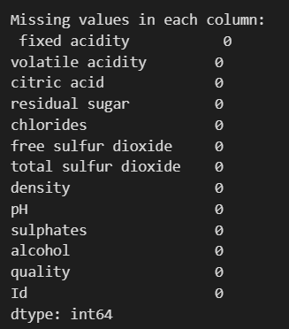
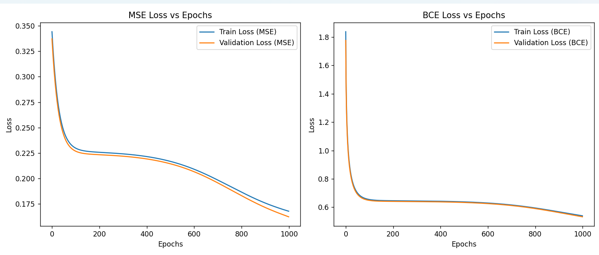

# Assignment 3 Report

## Multi Layer Perceptron Classification
### 2.1 Dataset Analysis and Preprocessing


- Descriptive Statistics for the Dataset :


- Checking for missing values :



Since there are no missing values in the dataset, there is no need for data imputation step.

- Descriptive Statistics of the dataset, after normalization/standardization :


- Distribution of wine quality labels :


- Trail Run : For `Hidden Layers = [64, 32
- ]`, `Learning Rate = 0.01`, `Activation Function = ReLU`, `Optimizer = Batch`, `Epochs = 1000`, we get the following output :
```python
{'train_loss': 0.09053712540118695, 'val_loss': 0.1074418348085183, 'train_accuracy': 0.8364963503649635, 'val_accuracy': 0.7982456140350878, 'train_f1': 0.24931790180020225, 'val_f1': 0.1775609756097561, 'train_precision': 0.2952252495279201, 'val_precision': 0.16106194690265488, 'train_recall': 0.21576636288318146, 'val_recall': 0.19782608695652174}
```

### 2.3 Model Training & Hyperparameter Tuning using W&B
- After Model Training & Hyperparameter Tuning using W&B on the following combinations of hyperparameters :
```python
hyperparameter_space = {
    "learning_rate": [0.001, 0.01, 0.1],
    "hidden_layers": [[64], [64, 32], [64, 32, 16]],
    "activation_fn": ["relu", "tanh", "sigmoid", "linear"],
    "optimizer": ["batch", "sgd", "mini-batch"],
    "batch_size": [32, 64],
    "epochs": [100, 500]
}
```


[Link text](https://wandb.ai/prakhar-raj-prakhar-raj/mlp-classifier-final?nw=nwuserprakharraj)


- We get 432 combinations. This is the table generated listing the hyperparameters tested and their corresponding metrics - loss, accuracy, precision, f1-score, recall on train and validation set. Since it is difficult to show the entire table, we randomly sample 20 points :


- We choose the best model based on `accuracy on validation set`. Based on this selection, the parameters for the best model are as follows :


### 2.4 Evaluating Single-label Classification Model

Evaluating the model on the above reported hyperparameters, we get :


### 2.5 Analyzing Hyperparameters Effects

#### 1. Effect of Non-linearity :
We select four activation functions : `ReLU`, `Sigmoid`, `Tanh` and `Linear` and vary only these functions while keeping other hyperparameters constant.
The plot for loss v/s number of epochs for each activation function is as follows :


Observations :
- We observe that model early stops in the cases of linear and relu activation functions. This indicates that the loss either stops decreasing or potentially starts increasing after that point. In the case of linear activation function, since the early stopping occurs very quickly, than compared to relu activation function, the model capacity is too low for the problem. We can infer from these points that linear activation function perform poorly and thus there is a need for non-linear activation functions.

#### 2. Effect of Learning Rate :
We select four learning rates : `0.1`, `0.01`, `0.001` and `0.0001` and vary only these functions while keeping other hyperparameters constant.
The plot for loss v/s number of epochs for each activation function is as follows :


Observations :
- We observe that the model early stops in the cases of 0.1 and 0.01 learning rates. Especially in the case of 0.1 learning rate, there is a highly unstable trend of loss, indicating that the model is not being trained properly (because of the hight learning rate). 
- For these two cases, after few epochs, the loss stops decreasing and potentially starts to increase, indicating that the model missed a potential local minima point, because of the high learning rate.
- For learning rate 0.0001 and 0.001, the model does not stop early. However, 0.0001 is a very small learning rate and thus the model converges/reaches to a local minima point at a very slow rate. Thus the loss after all epochs is much less in case of 0.001 learning rate than in case fo 0.0001.
- Thus we need to make a balance between too low and too high learning rate. Hence, we can infer that 0.001 is an optimal learning rate.

#### 3. Effect of Batch Size :
We select four batch sizes : `8`, `16`, `32` and `64` and vary only these functions while keeping other hyperparameters constant.
The plot for loss v/s number of epochs for each activation function is as follows :


The final loss obtained are as follows :


Observations :
- Similar to the above cases, for batch sizes 8 and 16, the model early stops; indicating a potential increase of loss thereafter.
- For batch size 32 and 64, though it does not stop early, the loss in case of 32 is lower than that of 64. We can also observe from the graph plot, that in case of batch size 64, the loss converges slowly than in case of 32.
- Thus we can infer that 32 is an optimal batch size.

### 2.6 Multi-Label Classification


[Link text](https://wandb.ai/https://wandb.ai/prakhar-raj-prakhar-raj/multi-label-classifier?nw=nwuserprakharraj)


- Trail Run : For `Hidden Layers = [64, 32]`, `Learning Rate = 0.01`, `Activation Function = Sigmoid`, `Optimizer = Batch`, `Epochs = 500`, we get the following output :
```python
'train_accuracy': 0.015, 'val_accuracy': 0.01, 'train_f1': 0.38763127242139117, 'val_f1': 0.32177584169690904, 'train_precision': 0.4307384332659479, 'val_precision': 0.31651496199484924, 'train_recall': 0.35236729626539565, 'val_recall': 0.3272145726510062, 'train_hamming_loss': 0.39395833333333335, 'val_hamming_loss': 0.460625
```

- We get 432 combinations. This is the table generated listing the hyperparameters tested and their corresponding metrics - loss, accuracy, precision, f1-score, recall on train and validation set. 


- We choose the best model based on `accuracy on validation set`. Based on this selection, the parameters for the best model are as follows :
```python
{
    activation : "relu",
    batch_size : "64, 
    epochs : "500",
    hidden_layers : "[64, 32]",
    learning_rate : "0.1",
    optimizer : "mini-batch",
    
    validation_accuracy : "0.04",
    validaton_hamming_loss : "0.410625",
    validation_precision : "0.316794738715452",
    validation_f1_score : "0.238311641929076",
    validation_recall : "0.190994459947499"
}
```


Using soft accuracy:


### 2.7 Analysis

For the test data set, we get the following outputs of actual class v/s predicted class :

We get the following confusion matrix heat map :


- We can clearly see that class 6 is getting predicted very well. Whereas for class 7, it is performing bad.
- A possible explanation for this can be that the `dataset is highly concentrated/skewed towards class 6`. That is, there are lot many class 6 (and class 5) data points compared to other classes. Infact, in the test dataset, there are only class 6 and class 7 datapoints. There is not even a single datapoint from other classes.
- Since the distribution of the dataset is not uniform, the model is also trained so as to be `biased/skewed` towards the class with majority frequency.

## Multi Layer Perceptron Regression
### 3.1 Data Preprocessing
- Checking the Summary of data after loading :


- Checking for missing values :


- Plots for distribution of dataset before normalization/standardization :


- Trail Run : For `Hidden Layers = [64, 32, 16]`, `Learning Rate = 0.01`, `Activation Function = Tanh`, `Optimizer = Batch`, `Epochs = 1000`, we get the following output :
```python
{'train_loss': 0.30940955484348054, 'val_loss': 0.38299920231570683, 'train_rmse': 0.5562459481591578, 'val_rmse': 0.6188692934018514, 'train_rsquare': 0.6792151637757703, 'val_rsquare': 0.5543853672570607, 'train_mae': 0.35196860854962836, 'val_mae': 0.35124209927357697}
```

#### NOTE - Regarding Normalization of Target Variable
Unlike in the case of classification, in regression we are to predict a value that has a continuous range. So there are two ways to achieve it :
1. Do not normalize/standatdize the target variable/attribute. Normalize/sandardize all other variables/attributes. Train the model and predict.
2. Normalize/standardize the target variable/attribute as well, along with all other variables/attributes. Train the model an predict. Now we need to de-normalize the prediction [multiply with the original standard deviation and add the original mean], to get the actual prediction.

Since the assignment asks us to use sigmoid and tanh activation functions as well, method 1 mentioned above cannot be used, because the range of sigmoid and tanh are bounded - [0, 1] and [-1, 1] respectively. Hence, we need to normalize the target variable as well. As reasoned above, to get the actual predicted value (predicted house values), we need to de-normalize the predictions. However, since the assignment only focusses on the performance metrics and losses, and not the actual predicted house value, there is no necessity to de-normalize the predictions.

### 3.3 Model Training & Hyperparameter Tuning using W&B


[Link text](https://wandb.ai/prakhar-raj-prakhar-raj/mlp-regressor-final?nw=nwuserprakharraj)


- After Model Training & Hyperparameter Tuning using W&B on the following combinations of hyperparameters :
```python
hyperparameter_space = {
    "learning_rate": [0.001, 0.01, 0.1],
    "hidden_layers": [[64], [64, 32], [64, 32, 16]],
    "activation_fn": ["relu", "tanh", "sigmoid", "linear"],
    "optimizer": ["batch", "sgd", "mini-batch"],
    "batch_size": [32, 64],
    "epochs": [100, 500]
}
```
- We get 432 combinations. This is the table generated listing the hyperparameters tested and their corresponding metrics - loss [mean square error], rmse [root mean square error], mae [mean absolute error], R Square error on train and validation set. Since it is difficult to show the entire table, we randomly sample 20 points :


- We choose the best model based on `mse on validation set`. Based on this selection, the parameters for the best model are as follows :
```python
{
    activation : "linear",
    batch_size : "64, 
    epochs : "500",
    hidden_layers : "[64, 32, 16]",
    learning_rate : "0.01",
    optimizer : "mini-batch",
    
    validaton_loss : "0.215777140488139",
    validation_mae : "0.3368609123727",
    validation_rsquare : "0.759515108292902"
}
```

### 3.4 Evaluating Model
Evaluating the model on the above reported hyperparameters, we get :
```python
test MSE : 0.3512518632553894
test RMSE : 0.5926650514880976
test MAE : 0.39236196367599524
test R-Square : 0.6334461525667061
```

### 3.5 Mean Squared Error vs Binary Cross Entropy

- The loss v/s epochs for the models are as follows :




- The observations are :

1. BCE loss converges faster. MSE loss takes longer to converge
2. BCE loss curve shows a steep initial decrease followed by a more gradual decrease. MSE loss curve might show a more gradual decrease throughout training.

### 3.6 Analysis


- We observe that for the `MSE loss is high in case of outliers` - where the concentration of true values is very low.
- For normal/regular data, the MSE loss is satisfactorily low. Especially for the data that is more dense - concentrated at the mean.

### 3.7 BONUS
- There are several commonalities between MLP Classification task and MLP Regression task. The network architecture (hyperparameters), weights and bias , connections, activation functions, optimizers, forward propagation and back propagation steps, etc are same.
- The difference are :
1. `Loss function` : Classification uses `entropy` as loss function, whereas Regression uses `Mean Squared Error` loss function.
2. `Activation function in the output layer` : In Classification after the final layer, we use a `softmax` function, whereas in Regression, we use the same activation function as previous layers.
3. `Performane metrics` : In Classification, we use `accuracy`, `precision`, `f1 score`, `recall` as performance metrics, whereas in Regression, we use `MSE`, `MAE`, `RMSE`, `R Squared` as performance metrics.

The calculation of gradients and the back propagation steps are the same for both tasks.

Hence, we can integrate both of them into a single class. We pass a `task` - parameter to the class to indicate if it is a Classification task or a Regression task. Using this parameter, we can calculate the loss function and performance metrics accordingly. It has not been implemented in code.

## AutoEncoders


- Applying KNN on the reduced dataset, we get the following outputs :


```python
KNN Metrics:
{'macro_precision': 0.014731446400713172, 'macro_recall': 0.025, 'macro_f1': 0.018538774365446642,  'micro_precision': 0.05892578560285269, 'micro_recall': 0.05892578560285269, 'micro_f1': 0.05892578560285269}
```

Which is much than what is obtained in Assignment 1 and Assignment 2 :

```python
Original dataset (Assignment 1) :
{'macro_precision': 0.2835689725314542, 'macro_recall': 0.28029492029471637, 'macro_f1': 0.2819224410890299, 'macro_accuracy': 0.3055493648317361, 'micro_precision': 0.3055493648317361, 'micro_recall': 0.3055493648317361, 'micro_f1': 0.3055493648317361, 'micro_accuracy': 0.3055493648317361}

Reduced dataset (Assignment 2) :
{'macro_precision': nan, 'macro_recall': 0.035835790428668635, 'macro_f1': nan, 'macro_accuracy': 0.047024738132382435, 'micro_precision': 0.047024738132382435, 'micro_recall': 0.047024738132382435, 'micro_f1': 0.047024738132382435, 'micro_accuracy': 0.047024738132382435}
```

The reason being :
- The reduced dataset might not caputure the correlation among the original components/dimensions. The decrease in accuracy for the reduced dataset after dimensionality reduction is likely due to information loss, as PCA discards some variance that might be important for classification. Additionally, PCA is a linear method, and it may miss non-linear relationships or important feature interactions critical for distinguishing between classes. While it aims to preserve variance, it does not optimize for class separability, potentially reducing the model’s discriminative power. 

1. Mini-batch optimizer
2. Gradients check
