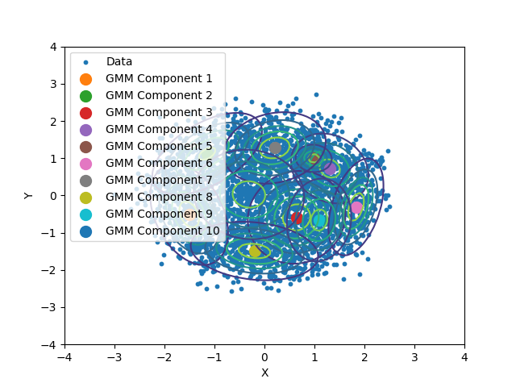
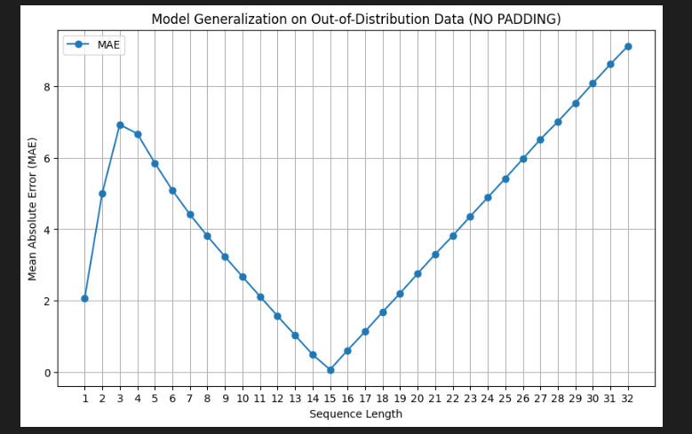

# Statistical Methods in Artificial Intelligence
---

### Assignment 5 (report)

## **KDE**


I have implement the Kernel Denisty Estimation (KDE) algorithm from scratch for n-dimensional data and compare its performance against Gaussian Mixture Models (GMM) (which I wrote in assignment-2)  on a synthetic dataset generated as instructed :


After fitting a KDE model, on the above dataset :


After fitting  a GMM model with 2 component on the above dataset :


- The components are positioned to cover regions of higher density.

On increasing the no. of model for the GMM model :




- The KDE model provides a more continuous and smooth density estimate, while the GMM model, as the number of components increases, adapts to the data by adding more localized Gaussian clusters.
- The KDE model is consistent in capturing the overall density but does not explicitly identify clusters or component distributions.
- The GMM, in contrast, can better represent distinct subpopulations in the data as the number of components increases, potentially matching KDE’s density estimate with sufficient components but with a focus on discrete clusters rather than a continuous distribution.


## **HMMs**
Speech Digit Recognition


### Visualising the MFCC features:

- 0_yweweler_11 :


- 2_theo_29 :


- 3_nicolas_49 :


- 4_lucas_3 :


- 5_george_23 :


- 7_yweweler_25 :


- 9_george_6 :


Firstly I am extracting the Mel-Frequency Cepstral Coefficients
(MFCC) from .wav files and saving the MFCC features in a .csv file.
```

Saved MFCC for 9_jackson_46.wav to ../../data/training_mfcc\9_jackson_46.wav.csv
Saved MFCC for 9_jackson_47.wav to ../../data/training_mfcc\9_jackson_47.wav.csv
Saved MFCC for 9_jackson_48.wav to ../../data/training_mfcc\9_jackson_48.wav.csv


```

---
- All files of iteration 0-4 move to testing-set
- All files of iteration 5-49 move to training-set
---

### Now, I am training the model on the training set :


- I have printed outputs (**trrue & predicted digits**) and the probability score for each digits:


### I am getting accuracy:


### I have made my own personal recording test set with 40 recordings 4 different for each digits and tested the model :

- So I am getting about 47.5% accuracy


### Effect on Features: 

- MFCC features are highly sensitive to the sampling rate.
- Higher sr values provide finer frequency resolution, but might also lead to the model focusing on frequency ranges that don’t carry important information for digit recognition (e.g., very high or low frequencies).
- The model might then struggle to generalize if the training data used a lower sampling rate 


---
---


# RNN
## **Counting Bits**
---

In this task, I have trained an RNN that learns to count the number of 1 bits in an input bit-stream.

I have Constructed a dataset of binary sequences. 
It have 100k sequences of randobits with lengths varying from 1 to 16 for training. Each sequence is paired with a label indicating the count of ‘1‘s in the sequence. This gives 100k (sequence,count) pairs.

examples:

 training, validation, and test split are with ratios (0.8, 0.1, 0.1)

```
Examples from the dataset:
Training Data (First 3 examples): 
[([1, 0, 1, 1, 1, 1, 1, 0, 0, 0, 1, 0, 0, 1], 8), ([0, 1, 1, 1, 0, 0, 1, 0, 1, 0, 1, 0, 0, 1], 7), ([1], 1)]

Validation Data (First 3 examples): 
[([0], 0), ([0, 1, 0, 0, 0, 1, 1, 1, 0, 1, 0, 1, 1, 1, 0, 1], 9), ([0, 1, 1, 1, 1, 0, 1, 0], 5)]

Test Data (First 3 examples): 
[([0, 0], 0), ([1, 0, 1, 0, 1, 0, 1, 1, 1, 1], 7), ([0], 0)]

```

---
---


Then I have Implemented a basic training loop that evaluates the model on a validation set after every epoch. I have used **Mean Absolute Error (MAE)** as the evaluation metric:


- In this task, I tried to study how well our trained model generalizes to out of distribution data.
- I generated 1000 samples of sequence length 1 to 32, from
the dataset generator, then ran the evaluation loop for this data set with the already trained model. **(which was trained on length 1 to 16)**
- I have plotted the metrics with input sequence length from 1 to 32 (x-axis is the sequence length, y-axis is the MAE for that sequence length):

####  The sequences are not  PADDED :

####  The sequences are  PADDED to 16 only TILL 16 :


####  All the sequences are   PADDED upto 32 :


---
---

## Optical Character Recognition

In this task, I have trained an RNN to recognize words within an image.


### Dataset 

- I have constructed the dataset from scratch. Firstly collected 100k words (from nltk.corpus import words) and rendered these words onto
images of size 256x64.

- Now I have 100k image-
word pairs in dataset. Some examples:


---
---


- Implemented a basic training loop that evaluates the model on a validation set
 after every epoch. 
- In addition to the metrics, I have provided some examples of ground truth versus model
 prediction.
- I have used Average Number of Correct Characters as the evaluation
 metric, measuring how many predicted characters match the target in value
 and position, averaged across samples. 

- output:


